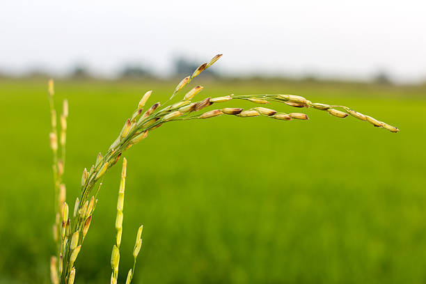

# Revitalizing Paddy Yields with Computer Vision

## Project Hypothesis / Research Question

❓ **Can deep learning models, specifically Convolutional Neural Networks (CNNs), accurately detect and classify multiple nutrient deficiencies in paddy plants through leaf image analysis with greater accuracy than human experts?**

---

## Significance of the Problem

Nutrient deficiencies in crops significantly impact agricultural productivity, affecting growth rates, yield, and overall plant health. While visual symptoms appear on leaves, their accurate identification requires extensive expertise and is particularly challenging in early stages. Traditional manual inspection is time-consuming, subjective, and often leads to delayed interventions. 

An automated, accurate detection system could revolutionize crop management by enabling early intervention and precise nutrient application.

---

## Data Sources

- **November 1, 2021:** Reached out to a local small business association.

---

## Approach

### Image Preprocessing
- **Segmentation:** Segmentation of input leaf images into 224×224 pixel blocks.
- **Standardization:** Standardization of image data for consistent analysis.

### Model Architecture

#### Base Model
- Pre-trained **ResNet-50**.

#### Additional Layers
- **Dense Layer:** 1024 neurons with ReLU activation.
- **Output Layer:** Matches the number of classes.
- Implementation of **softmax activation** for final classification.

---

## Progress & Findings

- **Achieved:** 97.22% accuracy in nutrient deficiency classification.
- **Model Loss:** Reduced to 0.1448 after training.
- **Distinctive Features Identified for Each Deficiency Type:**
  - **Nitrogen:** Lemon-yellowish green coloration.
  - **Phosphorus:** Stunted dark green appearance.
  - **Potassium:** Yellowish brown leaf tips.
  - **Zinc:** Characteristic brown spots.
